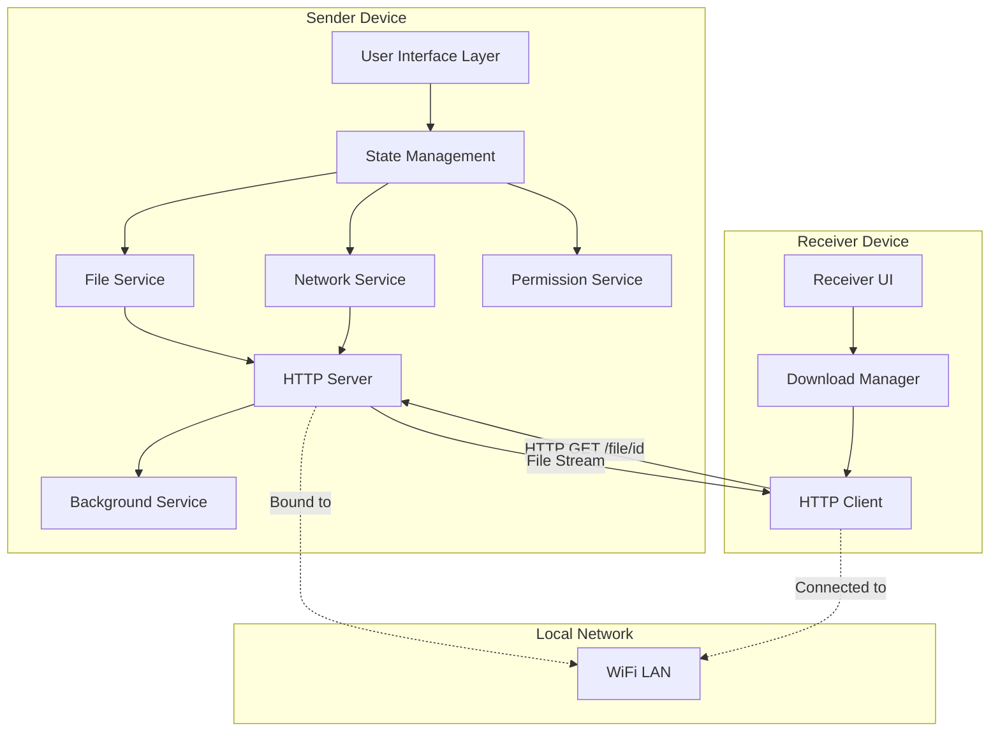
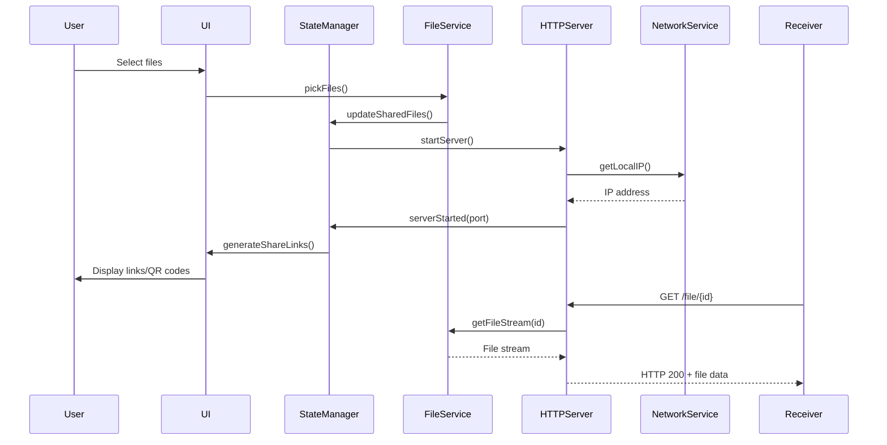

# Design Document: Flutter Multi-Platform File Sharing Application

## Overview

The Flutter Multi-Platform File Sharing Application is a cross-platform solution that enables users to share files across devices on the same local area network (LAN) using HTTP-based file transfer. The application runs a local HTTP server on the sender device, generates shareable links, and allows receiver devices to download files via standard HTTP requests.

### Key Design Goals

1. **Cross-Platform Compatibility**: Support Android, iOS, Linux, Windows, macOS, and Web platforms with a single codebase
2. **Simplicity**: Minimize user friction by leveraging local network discovery and HTTP-based transfers
3. **Reliability**: Ensure file transfers complete successfully even when the app is backgrounded
4. **Security**: Restrict access to local network only and use cryptographically secure file identifiers
5. **Performance**: Efficiently handle large files and concurrent downloads without excessive resource consumption

### Technology Stack

- **Framework**: Flutter 3.x with Dart
- **HTTP Server**: `shelf` package for Dart HTTP server implementation
- **File Picking**: `file_picker` package for cross-platform file selection
- **Network Info**: `network_info_plus` package for obtaining device IP address
- **Permissions**: `permission_handler` package for runtime permission management
- **QR Code**: `qr_flutter` package for generating QR codes
- **Background Service (Android)**: `flutter_foreground_task` or native Android Service
- **State Management**: Provider or Riverpod for reactive state management

## Architecture

### High-Level Architecture



### Layered Architecture

The application follows a layered architecture pattern:

1. **Presentation Layer**: Flutter UI components, screens, and widgets
2. **Application Layer**: State management, business logic, and use cases
3. **Domain Layer**: Core entities, value objects, and domain logic
4. **Infrastructure Layer**: Platform-specific implementations, HTTP server, file system access
5. **Platform Layer**: Native platform integrations (Android, iOS, Desktop)

### Component Interaction Flow



## Components and Interfaces

### 1. File Service

**Responsibility**: Manage file selection, storage, and retrieval.

**Interface**:
```dart
abstract class FileService {
  /// Pick single or multiple files from device storage
  Future<List<SharedFile>> pickFiles({bool multiple = true});
  
  /// Get file metadata without reading content
  Future<FileMetadata> getFileMetadata(String path);
  
  /// Get file stream for HTTP serving
  Stream<List<int>> getFileStream(String fileId);
  
  /// Validate file is readable
  Future<bool> validateFile(String path);
  
  /// Get file by identifier
  SharedFile? getFileById(String fileId);
  
  /// Remove file from shared list
  void removeFile(String fileId);
  
  /// Clear all shared files
  void clearAllFiles();
}
```

**Key Classes**:
```dart
class SharedFile {
  final String id;              // Cryptographically random identifier
  final String name;            // Original filename
  final String path;            // Absolute file path
  final int size;               // File size in bytes
  final String mimeType;        // MIME type for Content-Type header
  final DateTime sharedAt;      // Timestamp when file was shared
}

class FileMetadata {
  final String name;
  final int size;
  final String mimeType;
  final DateTime lastModified;
}
```

### 2. HTTP Server Service

**Responsibility**: Run local HTTP server to serve files.

**Interface**:
```dart
abstract class HTTPServerService {
  /// Start HTTP server on available port
  Future<ServerInfo> startServer();
  
  /// Stop HTTP server gracefully
  Future<void> stopServer();
  
  /// Check if server is running
  bool get isRunning;
  
  /// Get current server info
  ServerInfo? get serverInfo;
  
  /// Register file for serving
  void registerFile(SharedFile file);
  
  /// Unregister file from serving
  void unregisterFile(String fileId);
  
  /// Get active connections count
  int get activeConnections;
  
  /// Stream of server events (requests, errors)
  Stream<ServerEvent> get events;
}
```

**Key Classes**:
```dart
class ServerInfo {
  final String ipAddress;       // Local LAN IP
  final int port;               // Server port
  final DateTime startedAt;     // Server start time
}

class ServerEvent {
  final ServerEventType type;   // REQUEST, ERROR, CONNECTION
  final String? fileId;
  final String? clientIp;
  final DateTime timestamp;
  final String? message;
}

enum ServerEventType {
  request,
  error,
  connectionOpened,
  connectionClosed,
}
```

**Implementation Details**:
- Use `shelf` package for HTTP server
- Bind to `0.0.0.0` or specific LAN interface
- Route: `GET /file/{id}` returns file stream
- Route: `GET /health` returns server status
- Set appropriate headers: `Content-Type`, `Content-Length`, `Content-Disposition`
- Support HTTP range requests for resumable downloads
- Implement request logging for debugging

### 3. Network Service

**Responsibility**: Manage network connectivity and IP address resolution.

**Interface**:
```dart
abstract class NetworkService {
  /// Get device's local IP address on LAN
  Future<String?> getLocalIPAddress();
  
  /// Get WiFi SSID
  Future<String?> getWiFiSSID();
  
  /// Check if connected to WiFi
  Future<bool> isConnectedToWiFi();
  
  /// Stream of network connectivity changes
  Stream<NetworkStatus> get networkStatusStream;
  
  /// Validate IP address is on local network
  bool isLocalNetworkAddress(String ip);
}
```

**Key Classes**:
```dart
class NetworkStatus {
  final bool isConnected;
  final String? ipAddress;
  final String? ssid;
  final NetworkType type;
}

enum NetworkType {
  wifi,
  mobile,
  ethernet,
  none,
}
```

### 4. Permission Service

**Responsibility**: Handle runtime permission requests across platforms.

**Interface**:
```dart
abstract class PermissionService {
  /// Request file access permissions
  Future<PermissionStatus> requestFilePermissions();
  
  /// Request network permissions
  Future<PermissionStatus> requestNetworkPermissions();
  
  /// Check if permission is granted
  Future<bool> isPermissionGranted(Permission permission);
  
  /// Open app settings for manual permission grant
  Future<void> openAppSettings();
  
  /// Get permission status
  Future<PermissionStatus> getPermissionStatus(Permission permission);
}
```

**Platform-Specific Behavior**:
- **Android < 13**: Request `READ_EXTERNAL_STORAGE`
- **Android >= 13**: Request `READ_MEDIA_IMAGES`, `READ_MEDIA_VIDEO`, `READ_MEDIA_AUDIO`
- **iOS**: Request photo library access
- **Desktop**: No runtime permissions needed
- **Web**: Use browser file picker (no permissions)

### 5. Background Service (Android)

**Responsibility**: Keep HTTP server running when app is backgrounded.

**Interface**:
```dart
abstract class BackgroundService {
  /// Start foreground service
  Future<void> startForegroundService();
  
  /// Stop foreground service
  Future<void> stopForegroundService();
  
  /// Check if service is running
  bool get isRunning;
  
  /// Update notification content
  void updateNotification(String content);
}
```

**Implementation Details**:
- Use Android Foreground Service
- Display persistent notification with:
  - Server status (IP:Port)
  - Number of shared files
  - Stop button action
- Handle notification tap to bring app to foreground
- Implement `onDestroy` to clean up resources

### 6. Share Link Generator

**Responsibility**: Generate and format shareable links and QR codes.

**Interface**:
```dart
abstract class ShareLinkGenerator {
  /// Generate HTTP URL for file
  String generateShareLink(String fileId, String ipAddress, int port);
  
  /// Generate QR code data
  String generateQRCode(String shareLink);
  
  /// Parse share link to extract file ID
  String? parseFileIdFromLink(String link);
  
  /// Validate share link format
  bool isValidShareLink(String link);
}
```

**Link Format**: `http://{ipAddress}:{port}/file/{fileId}`

### 7. State Manager

**Responsibility**: Manage application state reactively.

**State Classes**:
```dart
class AppState {
  final List<SharedFile> sharedFiles;
  final ServerInfo? serverInfo;
  final NetworkStatus networkStatus;
  final PermissionStatus filePermission;
  final bool isServerRunning;
  final int activeConnections;
  final List<ServerEvent> recentEvents;
}

class UIState {
  final bool isLoading;
  final String? errorMessage;
  final String? successMessage;
}
```

**State Management Approach**:
- Use Provider or Riverpod for dependency injection
- Separate UI state from domain state
- Implement ChangeNotifier for reactive updates
- Use StreamProvider for network status updates

## Data Models

### Core Domain Models

```dart
/// Represents a file being shared
class SharedFile {
  final String id;
  final String name;
  final String path;
  final int size;
  final String mimeType;
  final DateTime sharedAt;
  
  SharedFile({
    required this.id,
    required this.name,
    required this.path,
    required this.size,
    required this.mimeType,
    required this.sharedAt,
  });
  
  /// Generate unique cryptographic ID
  static String generateId() {
    final random = Random.secure();
    final bytes = List<int>.generate(16, (_) => random.nextInt(256));
    return base64UrlEncode(bytes).replaceAll('=', '');
  }
  
  /// Get file extension
  String get extension => path.split('.').last;
  
  /// Format file size for display
  String get formattedSize {
    if (size < 1024) return '$size B';
    if (size < 1024 * 1024) return '${(size / 1024).toStringAsFixed(1)} KB';
    if (size < 1024 * 1024 * 1024) return '${(size / (1024 * 1024)).toStringAsFixed(1)} MB';
    return '${(size / (1024 * 1024 * 1024)).toStringAsFixed(1)} GB';
  }
}

/// Server configuration and status
class ServerInfo {
  final String ipAddress;
  final int port;
  final DateTime startedAt;
  
  ServerInfo({
    required this.ipAddress,
    required this.port,
    required this.startedAt,
  });
  
  /// Get server base URL
  String get baseUrl => 'http://$ipAddress:$port';
  
  /// Get uptime duration
  Duration get uptime => DateTime.now().difference(startedAt);
}

/// Network connectivity status
class NetworkStatus {
  final bool isConnected;
  final String? ipAddress;
  final String? ssid;
  final NetworkType type;
  
  NetworkStatus({
    required this.isConnected,
    this.ipAddress,
    this.ssid,
    required this.type,
  });
  
  bool get isWiFi => type == NetworkType.wifi;
  bool get canShare => isConnected && isWiFi && ipAddress != null;
}

/// Server event for logging
class ServerEvent {
  final ServerEventType type;
  final String? fileId;
  final String? clientIp;
  final DateTime timestamp;
  final String? message;
  
  ServerEvent({
    required this.type,
    this.fileId,
    this.clientIp,
    required this.timestamp,
    this.message,
  });
  
  String get formattedTimestamp => 
    '${timestamp.hour}:${timestamp.minute}:${timestamp.second}';
}
```

### Value Objects

```dart
/// Represents a share link
class ShareLink {
  final String url;
  final String fileId;
  
  ShareLink({required this.url, required this.fileId});
  
  /// Parse URL to extract components
  static ShareLink? parse(String url) {
    final uri = Uri.tryParse(url);
    if (uri == null) return null;
    
    final pathSegments = uri.pathSegments;
    if (pathSegments.length != 2 || pathSegments[0] != 'file') {
      return null;
    }
    
    return ShareLink(url: url, fileId: pathSegments[1]);
  }
  
  /// Validate link format
  bool get isValid {
    final uri = Uri.tryParse(url);
    return uri != null && 
           uri.scheme == 'http' && 
           uri.pathSegments.length == 2 &&
           uri.pathSegments[0] == 'file';
  }
}

/// Permission status wrapper
enum PermissionStatus {
  granted,
  denied,
  permanentlyDenied,
  restricted,
  limited,
}
```

## Platform-Specific Implementation

### Android Configuration

**AndroidManifest.xml**:
```xml
<manifest>
  <uses-permission android:name="android.permission.INTERNET" />
  <uses-permission android:name="android.permission.ACCESS_WIFI_STATE" />
  <uses-permission android:name="android.permission.ACCESS_NETWORK_STATE" />
  
  <!-- For Android < 13 -->
  <uses-permission android:name="android.permission.READ_EXTERNAL_STORAGE"
                   android:maxSdkVersion="32" />
  
  <!-- For Android >= 13 -->
  <uses-permission android:name="android.permission.READ_MEDIA_IMAGES" />
  <uses-permission android:name="android.permission.READ_MEDIA_VIDEO" />
  <uses-permission android:name="android.permission.READ_MEDIA_AUDIO" />
  
  <!-- Foreground service -->
  <uses-permission android:name="android.permission.FOREGROUND_SERVICE" />
  <uses-permission android:name="android.permission.WAKE_LOCK" />
  
  <application
    android:usesCleartextTraffic="true"
    android:networkSecurityConfig="@xml/network_security_config">
    
    <service
      android:name=".FileShareService"
      android:foregroundServiceType="dataSync"
      android:exported="false" />
  </application>
</manifest>
```

**network_security_config.xml**:
```xml
<?xml version="1.0" encoding="utf-8"?>
<network-security-config>
  <base-config cleartextTrafficPermitted="false" />
  <domain-config cleartextTrafficPermitted="true">
    <domain includeSubdomains="true">192.168.0.0/16</domain>
    <domain includeSubdomains="true">10.0.0.0/8</domain>
    <domain includeSubdomains="true">172.16.0.0/12</domain>
    <domain includeSubdomains="true">localhost</domain>
  </domain-config>
</network-security-config>
```

**build.gradle**:
```gradle
android {
    compileSdkVersion 34
    
    defaultConfig {
        minSdkVersion 21
        targetSdkVersion 34
    }
}
```

### iOS Configuration

**Info.plist**:
```xml
<key>NSPhotoLibraryUsageDescription</key>
<string>Access photos to share files</string>

<key>NSLocalNetworkUsageDescription</key>
<string>Access local network to share files</string>

<key>NSBonjourServices</key>
<array>
  <string>_http._tcp</string>
</array>

<key>UIBackgroundModes</key>
<array>
  <string>fetch</string>
  <string>processing</string>
</array>
```

### Desktop Configuration

**Linux**: No special configuration needed
**Windows**: No special configuration needed
**macOS**: 
- Enable network entitlements
- Configure App Sandbox for network access

### Web Configuration

**Limitations**:
- Cannot run HTTP server (receiver mode only)
- Use browser's download API
- File picker uses browser's native picker

## API Specifications

### HTTP Server Endpoints

#### GET /file/{id}

**Description**: Download a shared file by its identifier.

**Request**:
```
GET /file/abc123xyz HTTP/1.1
Host: 192.168.1.100:8080
Range: bytes=0-1023 (optional)
```

**Response (Success)**:
```
HTTP/1.1 200 OK
Content-Type: application/octet-stream
Content-Length: 1048576
Content-Disposition: attachment; filename="document.pdf"
Accept-Ranges: bytes

[binary file data]
```

**Response (Partial Content)**:
```
HTTP/1.1 206 Partial Content
Content-Type: application/octet-stream
Content-Length: 1024
Content-Range: bytes 0-1023/1048576
Accept-Ranges: bytes

[partial binary file data]
```

**Response (Not Found)**:
```
HTTP/1.1 404 Not Found
Content-Type: application/json

{
  "error": "File not found",
  "fileId": "abc123xyz"
}
```

**Response (Server Error)**:
```
HTTP/1.1 500 Internal Server Error
Content-Type: application/json

{
  "error": "Failed to read file",
  "message": "Permission denied"
}
```

#### GET /health

**Description**: Check server health status.

**Response**:
```
HTTP/1.1 200 OK
Content-Type: application/json

{
  "status": "running",
  "uptime": 3600,
  "sharedFiles": 5,
  "activeConnections": 2
}
```

### Internal Service APIs

#### FileService API

```dart
// Pick files from device
final files = await fileService.pickFiles(multiple: true);

// Get file stream for serving
final stream = fileService.getFileStream('abc123xyz');

// Validate file accessibility
final isValid = await fileService.validateFile('/path/to/file');
```

#### HTTPServerService API

```dart
// Start server
final serverInfo = await httpServerService.startServer();
print('Server running at ${serverInfo.baseUrl}');

// Register file
httpServerService.registerFile(sharedFile);

// Listen to events
httpServerService.events.listen((event) {
  print('${event.type}: ${event.message}');
});

// Stop server
await httpServerService.stopServer();
```

#### NetworkService API

```dart
// Get local IP
final ip = await networkService.getLocalIPAddress();

// Check WiFi connection
final isWiFi = await networkService.isConnectedToWiFi();

// Monitor network changes
networkService.networkStatusStream.listen((status) {
  if (!status.isConnected) {
    // Handle disconnection
  }
});
```

## Security Design

### Threat Model

**Threats**:
1. Unauthorized access to shared files from outside LAN
2. File identifier guessing attacks
3. Man-in-the-middle attacks on local network
4. Malicious files being shared
5. Denial of service through excessive requests

### Security Measures

#### 1. Network Isolation
- Bind HTTP server only to local network interface
- Use network security config to restrict cleartext traffic to private IP ranges
- Validate client IP addresses are on local network

#### 2. Cryptographic File Identifiers
- Generate file IDs using `Random.secure()` with 128-bit entropy
- Use URL-safe base64 encoding
- IDs are not sequential or predictable
- Example: `xK9mP2nQ7vR8sT4uW5yZ6`

#### 3. Ephemeral Sharing
- File identifiers are only valid while server is running
- Clear all shared files when app closes
- No persistent storage of file mappings

#### 4. Optional Download Approval
- Configurable setting to require manual approval for each download
- Display requesting device IP address
- User can deny access to specific clients

#### 5. Rate Limiting
- Limit concurrent connections per client IP
- Throttle request rate to prevent DoS
- Maximum file size limits

#### 6. File Validation
- Validate file paths to prevent directory traversal
- Check file permissions before serving
- Sanitize filenames in Content-Disposition headers

### Privacy Considerations

- No telemetry or analytics
- No cloud storage or external servers
- All transfers occur directly between devices
- No persistent logs of shared files
- User can clear history at any time

## Error Handling

### Error Categories

#### 1. Permission Errors
```dart
class PermissionDeniedException implements Exception {
  final Permission permission;
  final String userMessage;
  
  PermissionDeniedException(this.permission, this.userMessage);
}
```

**Handling**:
- Display user-friendly message explaining why permission is needed
- Provide button to open app settings
- Allow user to retry after granting permission

#### 2. Network Errors
```dart
class NetworkException implements Exception {
  final NetworkErrorType type;
  final String message;
  
  NetworkException(this.type, this.message);
}

enum NetworkErrorType {
  noWiFi,
  noIPAddress,
  serverStartFailed,
  connectionLost,
}
```

**Handling**:
- Display network status in UI
- Pause server when WiFi disconnects
- Resume server when WiFi reconnects
- Notify user of network changes

#### 3. File Errors
```dart
class FileException implements Exception {
  final FileErrorType type;
  final String path;
  final String message;
  
  FileException(this.type, this.path, this.message);
}

enum FileErrorType {
  notFound,
  notReadable,
  tooLarge,
  invalidPath,
}
```

**Handling**:
- Skip unreadable files during selection
- Display error for specific file
- Continue processing other files
- Log error for debugging

#### 4. Server Errors
```dart
class ServerException implements Exception {
  final ServerErrorType type;
  final String message;
  
  ServerException(this.type, this.message);
}

enum ServerErrorType {
  portInUse,
  bindFailed,
  startFailed,
  stopFailed,
}
```

**Handling**:
- Try alternative ports if default is in use
- Display specific error message to user
- Provide retry option
- Log detailed error for debugging

### Error Recovery Strategies

1. **Automatic Retry**: Network reconnection, server restart
2. **User Intervention**: Permission requests, settings changes
3. **Graceful Degradation**: Skip problematic files, continue with others
4. **Fallback**: Use alternative ports, simplified features

### Logging Strategy

```dart
enum LogLevel {
  debug,
  info,
  warning,
  error,
}

class Logger {
  static void log(LogLevel level, String message, [Object? error, StackTrace? stackTrace]) {
    // In debug mode: print to console
    // In release mode: write to file
    // User can export logs for troubleshooting
  }
}
```

## Performance Considerations

### File Streaming

**Strategy**: Use chunked streaming to avoid loading entire files into memory.

```dart
Stream<List<int>> streamFile(String path) async* {
  final file = File(path);
  const chunkSize = 64 * 1024; // 64 KB chunks
  
  final stream = file.openRead();
  await for (final chunk in stream) {
    yield chunk;
  }
}
```

**Benefits**:
- Constant memory usage regardless of file size
- Support for large files (>1 GB)
- Efficient network utilization

### Concurrent Downloads

**Strategy**: Limit concurrent connections and implement bandwidth throttling.

```dart
class ConnectionManager {
  static const maxConcurrentConnections = 10;
  static const maxConnectionsPerClient = 3;
  
  final Map<String, int> _clientConnections = {};
  int _totalConnections = 0;
  
  bool canAcceptConnection(String clientIp) {
    if (_totalConnections >= maxConcurrentConnections) return false;
    if ((_clientConnections[clientIp] ?? 0) >= maxConnectionsPerClient) return false;
    return true;
  }
}
```

### Memory Management

**Strategies**:
1. **File Metadata Caching**: Cache file metadata to avoid repeated disk access
2. **Stream Disposal**: Properly close file streams after transfer
3. **Weak References**: Use weak references for large objects
4. **Memory Monitoring**: Track memory usage and warn on high consumption

### Battery Optimization

**Strategies**:
1. **Idle Detection**: Reduce CPU usage when no active transfers
2. **Wake Lock**: Only hold wake lock during active transfers
3. **Battery Level Monitoring**: Warn user when battery is low (<15%)
4. **Adaptive Behavior**: Reduce background activity on low battery

### Network Optimization

**Strategies**:
1. **HTTP Range Requests**: Support resumable downloads
2. **Compression**: Optional gzip compression for text files
3. **Keep-Alive**: Reuse HTTP connections
4. **Buffer Tuning**: Optimize buffer sizes for network conditions

## Testing Strategy

### Unit Testing

**Focus Areas**:
- File identifier generation and validation
- Share link parsing and formatting
- Network address validation
- Permission status handling
- Error handling logic
- State management updates

**Example Tests**:
```dart
test('generateFileId creates unique identifiers', () {
  final id1 = SharedFile.generateId();
  final id2 = SharedFile.generateId();
  expect(id1, isNot(equals(id2)));
  expect(id1.length, greaterThan(20));
});

test('ShareLink.parse extracts file ID correctly', () {
  final link = ShareLink.parse('http://192.168.1.100:8080/file/abc123');
  expect(link?.fileId, equals('abc123'));
});

test('isLocalNetworkAddress validates private IPs', () {
  expect(networkService.isLocalNetworkAddress('192.168.1.1'), isTrue);
  expect(networkService.isLocalNetworkAddress('8.8.8.8'), isFalse);
});
```

### Integration Testing

**Focus Areas**:
- End-to-end file sharing workflow
- HTTP server start/stop lifecycle
- File upload and download
- Network connectivity changes
- Background service behavior
- Cross-platform compatibility

**Example Tests**:
```dart
testWidgets('complete file sharing workflow', (tester) async {
  // 1. Start app
  await tester.pumpWidget(MyApp());
  
  // 2. Select file
  await tester.tap(find.byIcon(Icons.add));
  await tester.pumpAndSettle();
  
  // 3. Verify server started
  expect(find.text('Server Running'), findsOneWidget);
  
  // 4. Verify share link displayed
  expect(find.textContaining('http://'), findsOneWidget);
  
  // 5. Simulate download request
  final response = await http.get(Uri.parse(shareLink));
  expect(response.statusCode, equals(200));
});
```

### Property-Based Testing

Property-based testing will be used to verify universal properties across many generated inputs. This is appropriate for this feature because it involves:
- Pure functions (URL generation, ID generation)
- Data transformations (file metadata extraction)
- Universal properties (round-trips, invariants)

**Property Testing Library**: Use `test` package with custom generators or `faker` for data generation.

**Configuration**: Minimum 100 iterations per property test.


## Correctness Properties

*A property is a characteristic or behavior that should hold true across all valid executions of a system—essentially, a formal statement about what the system should do. Properties serve as the bridge between human-readable specifications and machine-verifiable correctness guarantees.*

### Property 1: Private IP Address Validation

*For any* IP address, if it is in a private range (192.168.0.0/16, 10.0.0.0/8, 172.16.0.0/12, or localhost), then cleartext HTTP traffic should be allowed; otherwise, it should be denied.

**Validates: Requirements 4.3**

### Property 2: File Selection Returns Valid Data

*For any* file selected through the file picker, the returned data should include a non-null path and complete metadata (name, size, MIME type).

**Validates: Requirements 5.5**

### Property 3: Selected Files Are Readable

*For any* file returned by the file picker, it should pass the readability validation check.

**Validates: Requirements 5.7**

### Property 4: File Serving Returns Correct File

*For any* registered file with identifier ID, an HTTP GET request to `/file/{ID}` should return HTTP 200 status and the exact file data corresponding to that identifier.

**Validates: Requirements 6.3, 6.5**

### Property 5: File Identifier Uniqueness

*For any* set of files shared simultaneously, all generated file identifiers should be unique and cryptographically random with sufficient entropy (minimum 128 bits).

**Validates: Requirements 6.4, 16.2**

### Property 6: Invalid File Identifier Returns 404

*For any* file identifier that is not registered in the server, an HTTP GET request to `/file/{ID}` should return HTTP 404 status.

**Validates: Requirements 6.6**

### Property 7: Content-Type Header Matches File Type

*For any* file with a known extension, the HTTP response should include a Content-Type header that matches the expected MIME type for that extension.

**Validates: Requirements 6.7**

### Property 8: Request Logging

*For any* HTTP request received by the server, a corresponding log entry should be created with timestamp, client IP, requested file ID, and response status.

**Validates: Requirements 6.10, 13.7, 18.4**

### Property 9: Share Link Format Validation

*For any* valid IP address, port number, and file identifier, the generated share link should match the format `http://{ip}:{port}/file/{id}`, and parsing the link should correctly extract all three components.

**Validates: Requirements 7.1, 7.2, 7.3, 7.4**

### Property 10: QR Code Generation

*For any* valid share link, QR code generation should succeed and the encoded data should match the original link exactly.

**Validates: Requirements 7.7**

### Property 11: IP Address Change Updates All Links

*For any* set of active share links, when the device's IP address changes, all links should be updated to reflect the new IP address while preserving their port numbers and file identifiers.

**Validates: Requirements 7.8, 9.4**

### Property 12: Downloaded File Size Validation

*For any* file download, the size of the downloaded file should exactly match the Content-Length header value from the HTTP response.

**Validates: Requirements 8.6**

### Property 13: Alternative Port Selection

*For any* port that is already in use, the server should successfully start on a different available port within the valid range (1024-65535).

**Validates: Requirements 13.5**

### Property 14: Shared Files UI Display

*For any* set of currently shared files, the UI should display all files with their complete information (name, size, type, and share link).

**Validates: Requirements 12.1, 12.2, 12.3**

### Property 15: Client IP Display

*For any* download request received by the server, the requesting device's IP address should be displayed in the sender's UI.

**Validates: Requirements 16.6**

### Property 16: Ephemeral File Identifiers

*For any* sharing session, after the server is stopped, no file identifiers should exist in persistent storage.

**Validates: Requirements 16.3**

### Property 17: Bounded Memory Usage During Transfer

*For any* file transfer regardless of file size, the memory usage should remain bounded within a constant threshold (not proportional to file size).

**Validates: Requirements 17.1, 17.2**

### Property 18: File Handle Release

*For any* completed file transfer, the file handle should be closed immediately and not remain open.

**Validates: Requirements 17.4**

### Property 19: Metadata Caching

*For any* file, after the first metadata access, subsequent metadata accesses should return cached data without disk I/O.

**Validates: Requirements 17.6**

### Property 20: Resource Release When Idle

*For any* period when no files are being actively transferred, system resources (memory, file handles, network connections) should be released.

**Validates: Requirements 10.7**


## Error Handling

### Error Handling Strategy

The application implements a comprehensive error handling strategy with the following principles:

1. **User-Friendly Messages**: All errors displayed to users are clear, actionable, and free of technical jargon
2. **Graceful Degradation**: The app continues functioning when non-critical errors occur
3. **Detailed Logging**: All errors are logged with context for debugging
4. **Recovery Options**: Users are provided with clear paths to resolve errors

### Error Categories and Handling

#### Permission Errors

**Scenarios**:
- File access permission denied
- Network permission denied
- Platform-specific permission issues

**Handling**:
```dart
try {
  await permissionService.requestFilePermissions();
} on PermissionDeniedException catch (e) {
  // Display user-friendly explanation
  showDialog(
    title: 'Permission Required',
    message: e.userMessage,
    actions: [
      TextButton('Open Settings', onPressed: () => permissionService.openAppSettings()),
      TextButton('Cancel', onPressed: () => Navigator.pop(context)),
    ],
  );
}
```

**User Actions**:
- View explanation of why permission is needed
- Open system settings to grant permission
- Retry after granting permission

#### Network Errors

**Scenarios**:
- No WiFi connection
- Cannot obtain IP address
- Server fails to start
- Network disconnection during transfer

**Handling**:
```dart
networkService.networkStatusStream.listen((status) {
  if (!status.isConnected) {
    // Pause server
    httpServerService.stopServer();
    
    // Notify user
    showSnackBar('WiFi disconnected. File sharing paused.');
  } else if (status.isWiFi && status.ipAddress != null) {
    // Resume server
    httpServerService.startServer();
    
    // Update share links
    updateAllShareLinks(status.ipAddress!);
    
    showSnackBar('WiFi reconnected. File sharing resumed.');
  }
});
```

**User Actions**:
- Connect to WiFi network
- Wait for automatic reconnection
- View current network status

#### File Errors

**Scenarios**:
- File not found
- File not readable
- File too large
- Invalid file path

**Handling**:
```dart
Future<List<SharedFile>> pickAndValidateFiles() async {
  final files = await fileService.pickFiles(multiple: true);
  final validFiles = <SharedFile>[];
  
  for (final file in files) {
    try {
      final isValid = await fileService.validateFile(file.path);
      if (isValid) {
        validFiles.add(file);
      } else {
        logger.warning('File not readable: ${file.name}');
        showSnackBar('Skipped unreadable file: ${file.name}');
      }
    } catch (e) {
      logger.error('File validation error', e);
      showSnackBar('Error accessing file: ${file.name}');
    }
  }
  
  return validFiles;
}
```

**User Actions**:
- Select different files
- Check file permissions
- View list of successfully added files

#### Server Errors

**Scenarios**:
- Port already in use
- Server bind failure
- Server start failure
- Server crash during operation

**Handling**:
```dart
Future<ServerInfo> startServerWithRetry() async {
  int port = 8080;
  const maxAttempts = 10;
  
  for (int attempt = 0; attempt < maxAttempts; attempt++) {
    try {
      return await httpServerService.startServer(port: port);
    } on PortInUseException catch (e) {
      logger.info('Port $port in use, trying ${port + 1}');
      port++;
    } on ServerException catch (e) {
      logger.error('Server start failed', e);
      throw ServerException(
        ServerErrorType.startFailed,
        'Failed to start server: ${e.message}',
      );
    }
  }
  
  throw ServerException(
    ServerErrorType.startFailed,
    'Could not find available port after $maxAttempts attempts',
  );
}
```

**User Actions**:
- Retry server start
- Close other apps using network ports
- View error details in debug mode

#### Download Errors (Receiver)

**Scenarios**:
- Network timeout
- File not found (404)
- Storage full
- Download interrupted

**Handling**:
```dart
Future<void> downloadFile(String shareLink) async {
  try {
    final response = await http.get(Uri.parse(shareLink));
    
    if (response.statusCode == 404) {
      throw DownloadException('File no longer available');
    }
    
    if (response.statusCode != 200) {
      throw DownloadException('Download failed: HTTP ${response.statusCode}');
    }
    
    // Check storage space
    final fileSize = int.parse(response.headers['content-length'] ?? '0');
    final availableSpace = await getAvailableStorageSpace();
    
    if (fileSize > availableSpace) {
      throw StorageException('Not enough storage space');
    }
    
    // Download file
    await saveFile(response.bodyBytes);
    
    showSnackBar('Download complete');
  } on DownloadException catch (e) {
    showDialog(
      title: 'Download Failed',
      message: e.message,
      actions: [
        TextButton('Retry', onPressed: () => downloadFile(shareLink)),
        TextButton('Cancel', onPressed: () => Navigator.pop(context)),
      ],
    );
  } on StorageException catch (e) {
    showDialog(
      title: 'Storage Full',
      message: 'Free up space and try again',
      actions: [
        TextButton('Open Settings', onPressed: () => openStorageSettings()),
        TextButton('Cancel', onPressed: () => Navigator.pop(context)),
      ],
    );
  }
}
```

**User Actions**:
- Retry download
- Free up storage space
- Check network connection
- Request file to be shared again

### Logging Implementation

```dart
class AppLogger {
  static final _logs = <LogEntry>[];
  static const maxLogEntries = 1000;
  
  static void debug(String message, [Object? error, StackTrace? stackTrace]) {
    _log(LogLevel.debug, message, error, stackTrace);
  }
  
  static void info(String message) {
    _log(LogLevel.info, message);
  }
  
  static void warning(String message, [Object? error]) {
    _log(LogLevel.warning, message, error);
  }
  
  static void error(String message, Object error, [StackTrace? stackTrace]) {
    _log(LogLevel.error, message, error, stackTrace);
  }
  
  static void _log(LogLevel level, String message, [Object? error, StackTrace? stackTrace]) {
    final entry = LogEntry(
      level: level,
      message: message,
      error: error,
      stackTrace: stackTrace,
      timestamp: DateTime.now(),
    );
    
    _logs.add(entry);
    
    // Keep only recent logs
    if (_logs.length > maxLogEntries) {
      _logs.removeAt(0);
    }
    
    // Print to console in debug mode
    if (kDebugMode) {
      print('[${level.name.toUpperCase()}] $message');
      if (error != null) print('Error: $error');
      if (stackTrace != null) print('Stack trace: $stackTrace');
    }
  }
  
  static Future<File> exportLogs() async {
    final directory = await getApplicationDocumentsDirectory();
    final file = File('${directory.path}/file_sharing_logs_${DateTime.now().millisecondsSinceEpoch}.txt');
    
    final buffer = StringBuffer();
    for (final entry in _logs) {
      buffer.writeln('${entry.timestamp} [${entry.level.name}] ${entry.message}');
      if (entry.error != null) {
        buffer.writeln('  Error: ${entry.error}');
      }
      if (entry.stackTrace != null) {
        buffer.writeln('  Stack trace: ${entry.stackTrace}');
      }
      buffer.writeln();
    }
    
    await file.writeAsString(buffer.toString());
    return file;
  }
}
```

## Testing Strategy

### Overview

The testing strategy employs a comprehensive approach combining unit tests, integration tests, and property-based tests to ensure correctness across all platforms and scenarios.

### Testing Pyramid

```
         /\
        /  \  E2E Tests (10%)
       /____\
      /      \  Integration Tests (30%)
     /________\
    /          \  Unit Tests (40%)
   /____________\
  /              \  Property-Based Tests (20%)
 /________________\
```

### Unit Testing

**Scope**: Individual functions, classes, and components in isolation.

**Tools**:
- `test` package for Dart unit tests
- `mockito` for mocking dependencies
- `fake_async` for testing time-dependent code

**Coverage Areas**:
1. **File Service**:
   - File metadata extraction
   - File validation logic
   - MIME type detection
   - File ID generation

2. **Share Link Generator**:
   - Link format generation
   - Link parsing
   - QR code generation
   - Link validation

3. **Network Service**:
   - IP address validation
   - Private IP range detection
   - Network status parsing

4. **Permission Service**:
   - Permission status mapping
   - Platform-specific permission logic

5. **State Management**:
   - State updates
   - State transitions
   - Event handling

**Example Unit Tests**:
```dart
group('ShareLinkGenerator', () {
  test('generates correct link format', () {
    final generator = ShareLinkGenerator();
    final link = generator.generateShareLink('abc123', '192.168.1.100', 8080);
    expect(link, equals('http://192.168.1.100:8080/file/abc123'));
  });
  
  test('parses file ID from link', () {
    final generator = ShareLinkGenerator();
    final fileId = generator.parseFileIdFromLink('http://192.168.1.100:8080/file/abc123');
    expect(fileId, equals('abc123'));
  });
  
  test('validates correct link format', () {
    final generator = ShareLinkGenerator();
    expect(generator.isValidShareLink('http://192.168.1.100:8080/file/abc123'), isTrue);
    expect(generator.isValidShareLink('https://example.com/file/abc123'), isFalse);
    expect(generator.isValidShareLink('http://192.168.1.100:8080/invalid/abc123'), isFalse);
  });
});

group('NetworkService', () {
  test('identifies private IP addresses', () {
    final service = NetworkService();
    expect(service.isLocalNetworkAddress('192.168.1.1'), isTrue);
    expect(service.isLocalNetworkAddress('10.0.0.1'), isTrue);
    expect(service.isLocalNetworkAddress('172.16.0.1'), isTrue);
    expect(service.isLocalNetworkAddress('8.8.8.8'), isFalse);
    expect(service.isLocalNetworkAddress('1.1.1.1'), isFalse);
  });
});

group('SharedFile', () {
  test('generates unique file IDs', () {
    final id1 = SharedFile.generateId();
    final id2 = SharedFile.generateId();
    expect(id1, isNot(equals(id2)));
    expect(id1.length, greaterThanOrEqualTo(20));
  });
  
  test('formats file size correctly', () {
    final file = SharedFile(
      id: 'test',
      name: 'test.txt',
      path: '/path/test.txt',
      size: 1536,
      mimeType: 'text/plain',
      sharedAt: DateTime.now(),
    );
    expect(file.formattedSize, equals('1.5 KB'));
  });
});
```

### Integration Testing

**Scope**: Interaction between components, platform integrations, and end-to-end workflows.

**Tools**:
- `integration_test` package for Flutter integration tests
- Platform-specific test harnesses
- Mock HTTP servers for testing

**Coverage Areas**:
1. **File Sharing Workflow**:
   - Select files → Start server → Generate links → Download files
   - Multiple file sharing
   - File removal and server cleanup

2. **Network Connectivity**:
   - WiFi connection/disconnection
   - IP address changes
   - Network type changes

3. **Background Service** (Android):
   - App backgrounding with active server
   - Notification display and actions
   - Service lifecycle

4. **Platform-Specific Features**:
   - File picker on each platform
   - Permission requests on mobile
   - System tray on desktop

5. **HTTP Server**:
   - Server start/stop
   - File serving
   - Concurrent downloads
   - Error responses

**Example Integration Tests**:
```dart
testWidgets('complete file sharing workflow', (tester) async {
  await tester.pumpWidget(MyApp());
  
  // Select files
  await tester.tap(find.byIcon(Icons.add));
  await tester.pumpAndSettle();
  
  // Mock file picker result
  when(mockFilePicker.pickFiles(multiple: true))
      .thenAnswer((_) async => [testFile]);
  
  // Verify server started
  await tester.pump(Duration(seconds: 1));
  expect(find.text('Server Running'), findsOneWidget);
  
  // Verify share link displayed
  expect(find.textContaining('http://'), findsOneWidget);
  
  // Extract share link
  final linkWidget = find.textContaining('http://').evaluate().first.widget as Text;
  final shareLink = linkWidget.data!;
  
  // Simulate download from receiver
  final response = await http.get(Uri.parse(shareLink));
  expect(response.statusCode, equals(200));
  expect(response.bodyBytes.length, equals(testFile.size));
  
  // Stop server
  await tester.tap(find.byIcon(Icons.stop));
  await tester.pumpAndSettle();
  
  // Verify server stopped
  expect(find.text('Server Stopped'), findsOneWidget);
});

testWidgets('network disconnection pauses server', (tester) async {
  await tester.pumpWidget(MyApp());
  
  // Start server
  await startServerWithFiles(tester);
  expect(find.text('Server Running'), findsOneWidget);
  
  // Simulate network disconnection
  mockNetworkService.simulateDisconnection();
  await tester.pump(Duration(seconds: 1));
  
  // Verify server paused
  expect(find.text('WiFi Disconnected'), findsOneWidget);
  expect(find.text('Server Paused'), findsOneWidget);
  
  // Simulate reconnection
  mockNetworkService.simulateReconnection('192.168.1.101');
  await tester.pump(Duration(seconds: 1));
  
  // Verify server resumed with updated IP
  expect(find.text('Server Running'), findsOneWidget);
  expect(find.textContaining('192.168.1.101'), findsOneWidget);
});
```

### Property-Based Testing

**Scope**: Universal properties that should hold for all valid inputs.

**Tools**:
- `test` package with custom generators
- `faker` package for generating test data
- Custom property test framework

**Configuration**:
- Minimum 100 iterations per property test
- Each test tagged with: `Feature: flutter-multiplatform-file-sharing, Property {number}: {property_text}`

**Property Test Implementation**:

```dart
// Property 1: Private IP Address Validation
test('Property 1: Private IP address validation', () {
  final generator = IPAddressGenerator();
  
  for (int i = 0; i < 100; i++) {
    // Generate private IP
    final privateIP = generator.generatePrivateIP();
    expect(networkService.isLocalNetworkAddress(privateIP), isTrue,
        reason: 'Private IP $privateIP should be allowed');
    
    // Generate public IP
    final publicIP = generator.generatePublicIP();
    expect(networkService.isLocalNetworkAddress(publicIP), isFalse,
        reason: 'Public IP $publicIP should be denied');
  }
}, tags: ['property', 'Feature: flutter-multiplatform-file-sharing, Property 1: Private IP address validation']);

// Property 5: File Identifier Uniqueness
test('Property 5: File identifier uniqueness', () {
  final ids = <String>{};
  
  for (int i = 0; i < 100; i++) {
    final id = SharedFile.generateId();
    expect(ids.contains(id), isFalse, reason: 'ID $id should be unique');
    expect(id.length, greaterThanOrEqualTo(20), reason: 'ID should have sufficient length');
    ids.add(id);
  }
}, tags: ['property', 'Feature: flutter-multiplatform-file-sharing, Property 5: File identifier uniqueness']);

// Property 9: Share Link Format Validation
test('Property 9: Share link format validation', () {
  final generator = ShareLinkGenerator();
  final ipGen = IPAddressGenerator();
  final random = Random();
  
  for (int i = 0; i < 100; i++) {
    final ip = ipGen.generatePrivateIP();
    final port = 1024 + random.nextInt(64512); // 1024-65535
    final fileId = SharedFile.generateId();
    
    // Generate link
    final link = generator.generateShareLink(fileId, ip, port);
    
    // Validate format
    expect(link, startsWith('http://'));
    expect(link, contains(ip));
    expect(link, contains(':$port'));
    expect(link, endsWith('/file/$fileId'));
    
    // Parse and verify
    final parsed = ShareLink.parse(link);
    expect(parsed, isNotNull);
    expect(parsed!.fileId, equals(fileId));
  }
}, tags: ['property', 'Feature: flutter-multiplatform-file-sharing, Property 9: Share link format validation']);

// Property 17: Bounded Memory Usage During Transfer
test('Property 17: Bounded memory usage during transfer', () async {
  final fileGen = TestFileGenerator();
  const maxMemoryIncrease = 100 * 1024 * 1024; // 100 MB
  
  for (int i = 0; i < 100; i++) {
    // Generate file of random size (1 MB to 1 GB)
    final fileSize = (1 + Random().nextInt(1000)) * 1024 * 1024;
    final testFile = await fileGen.generateFile(fileSize);
    
    // Measure memory before
    final memoryBefore = await getMemoryUsage();
    
    // Stream file
    await for (final chunk in fileService.getFileStream(testFile.id)) {
      // Simulate processing
    }
    
    // Measure memory after
    final memoryAfter = await getMemoryUsage();
    final memoryIncrease = memoryAfter - memoryBefore;
    
    expect(memoryIncrease, lessThan(maxMemoryIncrease),
        reason: 'Memory increase ($memoryIncrease bytes) should be bounded for file size $fileSize');
    
    // Cleanup
    await fileGen.deleteFile(testFile);
  }
}, tags: ['property', 'Feature: flutter-multiplatform-file-sharing, Property 17: Bounded memory usage']);
```

**Test Data Generators**:

```dart
class IPAddressGenerator {
  final _random = Random();
  
  String generatePrivateIP() {
    final type = _random.nextInt(3);
    switch (type) {
      case 0: // 192.168.x.x
        return '192.168.${_random.nextInt(256)}.${_random.nextInt(256)}';
      case 1: // 10.x.x.x
        return '10.${_random.nextInt(256)}.${_random.nextInt(256)}.${_random.nextInt(256)}';
      case 2: // 172.16-31.x.x
        return '172.${16 + _random.nextInt(16)}.${_random.nextInt(256)}.${_random.nextInt(256)}';
      default:
        return '192.168.1.1';
    }
  }
  
  String generatePublicIP() {
    // Generate IP that's not in private ranges
    String ip;
    do {
      ip = '${_random.nextInt(256)}.${_random.nextInt(256)}.${_random.nextInt(256)}.${_random.nextInt(256)}';
    } while (_isPrivate(ip));
    return ip;
  }
  
  bool _isPrivate(String ip) {
    return ip.startsWith('192.168.') ||
           ip.startsWith('10.') ||
           (ip.startsWith('172.') && 
            int.parse(ip.split('.')[1]) >= 16 && 
            int.parse(ip.split('.')[1]) <= 31);
  }
}

class TestFileGenerator {
  Future<SharedFile> generateFile(int size) async {
    final tempDir = await getTemporaryDirectory();
    final file = File('${tempDir.path}/test_${DateTime.now().millisecondsSinceEpoch}.bin');
    
    // Generate random data
    final random = Random();
    final data = List<int>.generate(size, (_) => random.nextInt(256));
    await file.writeAsBytes(data);
    
    return SharedFile(
      id: SharedFile.generateId(),
      name: file.path.split('/').last,
      path: file.path,
      size: size,
      mimeType: 'application/octet-stream',
      sharedAt: DateTime.now(),
    );
  }
  
  Future<void> deleteFile(SharedFile file) async {
    await File(file.path).delete();
  }
}
```

### Platform-Specific Testing

**Android**:
- Test on multiple Android versions (API 21-34)
- Test permission flows for Android < 13 and >= 13
- Test background service behavior
- Test battery optimization handling
- Test cleartext traffic configuration

**iOS**:
- Test on iOS 13+
- Test file picker integration
- Test background modes
- Test network permissions

**Desktop** (Linux, Windows, macOS):
- Test file picker dialogs
- Test drag-and-drop
- Test system tray integration
- Test server binding to localhost

**Web**:
- Test receiver functionality only
- Test file download
- Test browser compatibility (Chrome, Firefox, Safari)

### Test Coverage Goals

- **Unit Tests**: 80% code coverage
- **Integration Tests**: All critical user workflows
- **Property Tests**: All 20 correctness properties
- **Platform Tests**: All supported platforms

### Continuous Integration

**CI Pipeline**:
1. Run unit tests on all commits
2. Run integration tests on pull requests
3. Run property tests nightly
4. Run platform-specific tests on platform changes
5. Generate coverage reports
6. Run static analysis (dart analyze)
7. Run code formatting checks (dart format)

**Test Execution**:
```bash
# Run all tests
flutter test

# Run unit tests only
flutter test test/unit

# Run integration tests
flutter test integration_test

# Run property tests
flutter test --tags=property

# Run with coverage
flutter test --coverage
genhtml coverage/lcov.info -o coverage/html
```

### Debug and Testing Tools

**Debug Mode Features**:
- Detailed request/response logging
- Network diagnostics tool
- Test mode for simulated transfers
- Log export functionality
- Performance monitoring

**Network Diagnostics Tool**:
```dart
class NetworkDiagnostics {
  Future<DiagnosticReport> runDiagnostics() async {
    final report = DiagnosticReport();
    
    // Check WiFi connectivity
    report.isWiFiConnected = await networkService.isConnectedToWiFi();
    
    // Get IP address
    report.ipAddress = await networkService.getLocalIPAddress();
    
    // Get SSID
    report.ssid = await networkService.getWiFiSSID();
    
    // Test server start
    try {
      final serverInfo = await httpServerService.startServer();
      report.canStartServer = true;
      report.serverPort = serverInfo.port;
      await httpServerService.stopServer();
    } catch (e) {
      report.canStartServer = false;
      report.serverError = e.toString();
    }
    
    // Test file access
    try {
      final files = await fileService.pickFiles(multiple: false);
      report.canAccessFiles = files.isNotEmpty;
    } catch (e) {
      report.canAccessFiles = false;
      report.fileAccessError = e.toString();
    }
    
    return report;
  }
}
```

This comprehensive testing strategy ensures the Flutter Multi-Platform File Sharing Application is reliable, correct, and performs well across all supported platforms.
